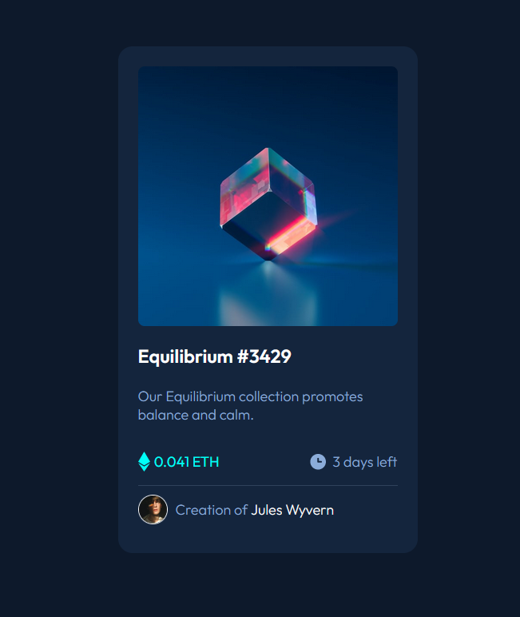

# Frontend Mentor - NFT preview card component solution

This is a solution to the [NFT preview card component challenge on Frontend Mentor](https://www.frontendmentor.io/challenges/nft-preview-card-component-SbdUL_w0U). Frontend Mentor challenges help you improve your coding skills by building realistic projects. 

## Table of contents

- [Overview](#overview)
  - [The challenge](#the-challenge)
  - [Screenshot](#screenshot)
  - [Links](#links)
- [My process](#my-process)
  - [Built with](#built-with)
- [Author](#author)

## Overview

### The challenge

Users should be able to:

- View the optimal layout depending on their device's screen size
- See hover states for interactive elements

### Screenshot

### Links

- Solution URL: [Solution](https://github.com/a-dri-an-S/nft-card)
- Live Site URL: [Live Site](https://dazzling-cray-2e6e7d.netlify.app/)

## My process
- Broke down design into both React components and CSS classes
- Created component structure and added content
- Finished by styling the components, starting from parent to children

### Built with

- Semantic HTML5 markup
- CSS custom properties
- Flexbox
- Mobile-first workflow
- [React](https://reactjs.org/) - JS library

## Author

- Frontend Mentor - [@a-dri-an-S](https://www.frontendmentor.io/profile/a-dri-an-S)